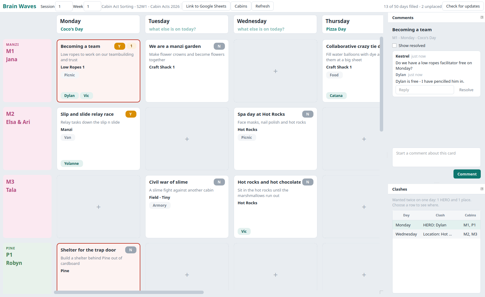

# Brain Waves

Cabin activity scheduling for Camp Augusta. Village leaders write each cabin's activity
ideas onto cards, the VL Brain drags those cards onto the days they will run, and everyone
discusses them in comments. Google Sheets stays the source of truth, so nothing is locked
inside the program.

Full documentation: the `docs/` folder, published with MkDocs to GitHub Pages.



## How it fits together

```
Google Drive ──┬── comments ──▶ google/comments.py ──▶ comments.py ─┐
               │                                                    │
               └── week sheet ──▶ sheets/week.py ──────────────────▶ model.py
                                        ▲                            │
                                        │                            ▼
                                  sheets/style.py               store.py ──▶ app/
                                  sheets/support.py                  │
                                        ▲                            │
                                        └──────── writes ────────────┘
```

| Module | Does |
|---|---|
| `brainwaves/model.py` | Cabin, CabinAct, Day, Week, Comment, and the moves on a week |
| `brainwaves/sheets/` | The Board format: geometry, parse, render, formatting, derived tabs |
| `brainwaves/google/` | Sign-in, Drive browsing, Drive comments |
| `brainwaves/comments.py` | Which card a Drive thread is about |
| `brainwaves/conflicts.py` | Two cabins wanting one place or one HERO on one day |
| `brainwaves/workspace.py` | Finding, opening and creating week sheets |
| `brainwaves/store.py` | One loaded week, every change to it, and the queue of writes |
| `brainwaves/app/` | The desktop window |
| `brainwaves/cli.py` | The `brainwaves` command |

## Install

Village leaders download one file from the
[releases page](https://github.com/camp-augusta/brainwaves/releases) and open it. There is
nothing else to install and no config file to place: camp's Google client and Skills doc
are built into the release, and the only per-person settings — the sign-in, the folder and
the week — are remembered by the program. From source:

```
git clone https://github.com/camp-augusta/brainwaves
cd brainwaves
python3 -m venv .venv
source .venv/bin/activate
pip install -e .
brainwaves
```

Then follow `docs/install.md` to create the Google OAuth client, write
`~/.config/brainwaves/config.toml`, and link the Drive folder that holds the week sheets.

## Use

```
brainwaves                                  # open the window
brainwaves sign-in                          # sign in to Google without the window
brainwaves where                            # which settings are in use, and where the sign-in lives
brainwaves template --csv /tmp/template     # write the blank week template out as CSV
brainwaves template --folder <drive id>     # create a blank week sheet in a Drive folder
```

## Develop

```
pip install -e ".[dev]"
ruff check . && ruff format --check .
pytest
mkdocs serve
python tools/screenshot.py docs/img/app.png
```

The test suite runs entirely offline; `tests/fakes.py` stands in for Google.
